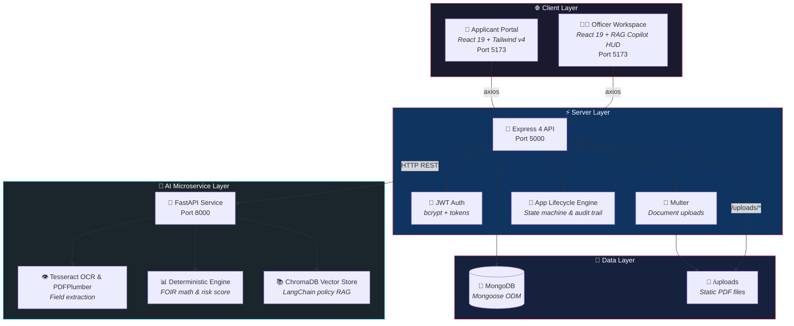

# LoanSight AI — Underwriting Intelligence Platform

> **An Enterprise-Grade, AI-Powered Loan Document Intelligence & Credit Assessment Platform.**

---

## 📌 Executive Summary

**LoanSight AI** is a modern microservices-based lending platform designed to automate retail loan underwriting for Indian banking standards (e.g., HDFC, ICICI, SBI). By combining **Computer Vision/OCR**, a **Deterministic Financial Risk Engine**, and a **Vector-Grounded Hybrid RAG Assistant**, LoanSight reduces manual loan processing time from **3 days to under 30 seconds**.

---

## ✨ Key Features & Capabilities

### 👨‍💻 For Applicants
- **Multi-Bank Application Flow**: Select lending partner bank, loan product (Personal, Home, Auto), requested amount, and tenure.
- **Document Ingestion**: Encrypted upload for identity proofs (PAN, Aadhaar) and financial proofs (Payslips, Bank Statements).
- **Real-Time Status Pipeline**: Instant tracking from `Submitted` to `Under Review` and `Approved`.

### 👩‍💼 For Loan Officers (Underwriting Workspace)
- **Unified Split-Pane Dashboard**: Inspect extracted financial metrics alongside original document previews.
- **Automated Discrepancy Detection**: Instant cross-matching highlights name/salary mismatches across PAN and bank statements.
- **Deterministic FOIR Engine**: Calculates Fixed Obligation to Income Ratio (FOIR), net disposable income, and EMI caps.
- **Hybrid Vector RAG Assistant**: Query indexed bank underwriting manuals (ChromaDB + LangChain + Gemini/Groq) for policy-cited credit decision support.
- **Immutable Audit Trail**: Append-only log tracking every status change, reprocessing event, and officer note.

---

## 🏗 Architecture



### Stack Breakdown

| Layer | Technology | Purpose |
| :--- | :--- | :--- |
| **Frontend** | React 19, Vite 8, Tailwind CSS v4, Lucide Icons, React Router 7 | High-precision executive UI, Applicant Portal, Officer Underwriting Workspace |
| **Backend API** | Node.js, Express 4, MongoDB, Mongoose 8, JWT, Multer | Core business logic, authentication, status state machine, upload storage |
| **AI Service** | Python 3.11, FastAPI, Pydantic, Uvicorn | High-throughput AI microservice for OCR, extraction, and validation |
| **OCR & Extraction**| Tesseract OCR, PDFPlumber, PyPDF | Extraction of names, monthly salary, account numbers, and DOB |
| **RAG & Vector AI** | LangChain, ChromaDB, Google Gemini API, Groq LLM | Vector indexing of banking policy manuals & interactive Assistant Q&A |

---

## 📁 Repository Structure

```
loansight/
├── frontend/                  # React + Vite Application
│   ├── src/
│   │   ├── components/        # Executive UI system & Officer widgets
│   │   │   ├── common/        # Button, Modal, Drawer, Table, Toast, Confirm
│   │   │   ├── layout/        # Navbar, Footer, Container
│   │   │   ├── officer/       # OfficerSidebar, LoanAssistantChat, VerificationTab
│   │   │   └── ui/            # DocumentRow, FileUpload, RiskIndicator, AIEvidenceBlock
│   │   ├── context/           # AuthContext, ToastContext, ConfirmContext, LanguageContext
│   │   ├── pages/             # Landing, Login, Register, ApplyLoan, Officer Pages
│   │   └── services/          # Axios API service handlers
│   └── package.json
│
├── backend/                   # Node.js Express API Server
│   ├── src/
│   │   ├── config/            # DB connection & server environment
│   │   ├── controllers/       # Auth & Application controllers
│   │   ├── middleware/        # JWT auth, error handlers, Multer upload
│   │   ├── models/            # User & Application Mongoose schemas
│   │   └── routes/            # REST API endpoints
│   ├── uploads/               # Document storage directory
│   └── package.json
│
├── ai-service/                # Python FastAPI Microservice
│   ├── main.py                # FastAPI entry point
│   ├── services/              # Document extraction, RAG, Financial Validators
│   │   ├── loan_officer_assistant.py  # RAG Assistant with safe-dict parsers
│   │   ├── policy_rag.py              # ChromaDB vector index & embeddings
│   │   ├── deterministic_validator.py # FOIR & credit rule calculations
│   │   └── identity_parser.py         # PAN/Aadhaar & Salary parsing
│   ├── data/                  # Sample bank policy PDFs & vector indexes
│   └── requirements.txt
└── README.md
```

---

## 🚀 Quick Start Guide

### Prerequisites
- **Node.js**: v18.0.0+
- **Python**: v3.10+
- **MongoDB**: Local instance or MongoDB Atlas URI
- **Tesseract OCR**: (Optional, for scanned image parsing)

---

### 1️⃣ Clone & Install Dependencies

```bash
# Clone the repository
git clone https://github.com/adityaa-nikam/loansight-main.git
cd loansight-main

# Install Node backend dependencies
cd backend && npm install

# Install Frontend dependencies
cd ../frontend && npm install

# Install Python AI Service dependencies
cd ../ai-service
python -m venv .venv
# On Windows:
.venv\Scripts\activate
# On macOS/Linux:
source .venv/bin/activate
pip install -r requirements.txt
```

---

### 2️⃣ Configure Environment Variables

Create `.env` files for each microservice:

#### **Backend** (`backend/.env`)
```env
PORT=5000
MONGODB_URI=mongodb://localhost:27017/loansight
JWT_SECRET=your_jwt_secret_key_here
CORS_ORIGIN=http://localhost:5173
```

#### **AI Service** (`ai-service/.env`)
```env
PORT=8000
GEMINI_API_KEY=your_google_gemini_api_key
GROQ_API_KEY=your_groq_api_key
```

#### **Frontend** (`frontend/.env`)
```env
VITE_API_BASE_URL=http://localhost:5000/api
```

---

### 3️⃣ Running the Microservices

Open 3 terminal windows to launch the microservices concurrently:

#### **Terminal 1: Express Backend**
```bash
cd backend
npm run dev
# Running on http://localhost:5000
```

#### **Terminal 2: Python AI Microservice**
```bash
cd ai-service
# Activate virtual environment
python -m uvicorn main:app --reload --port 8000
# Running on http://localhost:8000
```

#### **Terminal 3: React Frontend**
```bash
cd frontend
npm run dev
# Running on http://localhost:5173
```

---

## 📑 API Endpoint Overview

### Auth & Applications (`Express API`)
- `POST /api/auth/register` — Register new user/officer
- `POST /api/auth/login` — Sign in & retrieve JWT
- `GET /api/applications` — List all submitted loan applications
- `POST /api/applications` — Submit new application with documents
- `GET /api/applications/:id` — Get application details & AI extraction
- `PATCH /api/applications/:id/status` — Update underwriting status

### AI Microservice (`FastAPI`)
- `POST /api/v1/extract-documents` — Run OCR & financial parser
- `POST /api/v1/validate` — Compute FOIR & discrepancy flags
- `POST /api/v1/assistant/chat` — Query Vector RAG policy assistant

---

## 🔐 Security & Governance

- **Data Privacy**: Local disk/AWS S3 encrypted file storage with strict access controls.
- **Audit Compliance**: Immutable log entries for every credit decision, recalculation, and status update.
- **Safe Evaluation**: Defensive data structures (`_safe_dict`, safe parsing) ensure zero server crashes on incomplete OCR inputs.

---

## 📜 License

Distributed under the MIT License. See `LICENSE` for more information.
