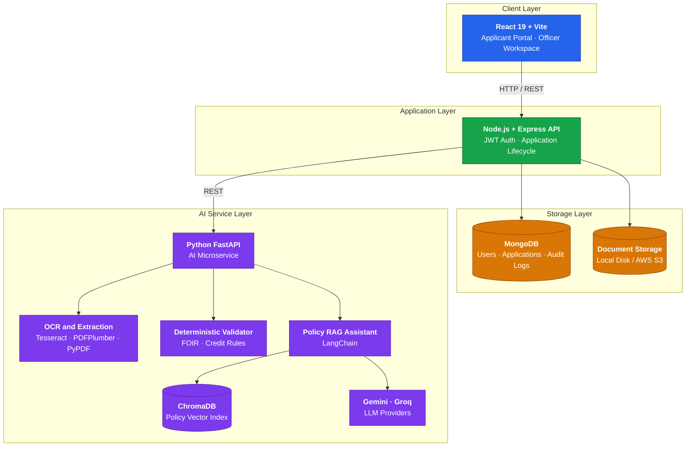
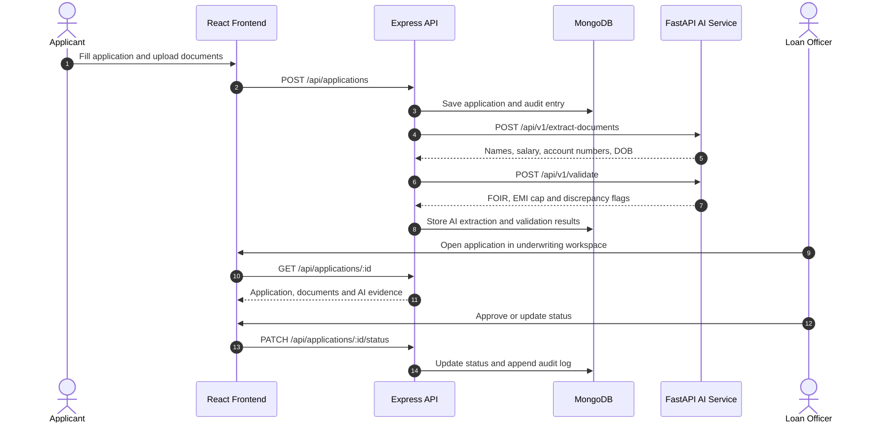

<div align="center">

# LoanSight AI

### Underwriting Intelligence Platform

**AI-powered loan document intelligence and credit assessment for Indian retail lending.**

<br/>


<br/>

[**Live Demo**](https://loansight-main.vercel.app/) &nbsp;·&nbsp; [**Backend API**](https://loansight-main.onrender.com/) &nbsp;·&nbsp; [**Architecture**](#-architecture) &nbsp;·&nbsp; [**Getting Started**](#-getting-started) &nbsp;·&nbsp; [**API Reference**](#-api-reference)

</div>

---

## 📌 Overview

**LoanSight AI** is a microservices-based lending platform that automates retail loan underwriting for Indian banking standards (HDFC, ICICI, SBI and similar). It combines **OCR-based document extraction**, a **deterministic financial risk engine**, and a **vector-grounded RAG assistant** to reduce manual loan processing time from **3 days to under 30 seconds**.

<table>
  <tr>
    <td width="33%" valign="top">
      <h4>🔍 Document Intelligence</h4>
      Extracts names, monthly salary, account numbers and date of birth from PAN, Aadhaar, payslips and bank statements using Tesseract OCR and PDFPlumber.
    </td>
    <td width="33%" valign="top">
      <h4>🧮 Deterministic Risk Engine</h4>
      Computes FOIR, net disposable income and EMI caps with rule-based logic, and flags discrepancies across documents.
    </td>
    <td width="33%" valign="top">
      <h4>🤖 Policy RAG Assistant</h4>
      Answers underwriting questions from indexed bank policy manuals using ChromaDB, LangChain and Gemini / Groq, with policy-cited responses.
    </td>
  </tr>
</table>

---

## ✨ Features

### 👨‍💻 Applicant Portal

| Feature | Description |
| :--- | :--- |
| **Multi-Bank Application Flow** | Select the lending partner, loan product (Personal, Home, Auto), requested amount and tenure |
| **Document Ingestion** | Encrypted upload of identity proofs (PAN, Aadhaar) and financial proofs (payslips, bank statements) |
| **Real-Time Status Pipeline** | Live tracking from `Submitted` to `Under Review` to `Approved` |

### 👩‍💼 Officer Underwriting Workspace

| Feature | Description |
| :--- | :--- |
| **Split-Pane Dashboard** | Inspect extracted financial metrics next to the original document previews |
| **Discrepancy Detection** | Cross-matches name and salary across PAN and bank statements and highlights mismatches |
| **FOIR Engine** | Calculates Fixed Obligation to Income Ratio, net disposable income and EMI caps |
| **Hybrid Vector RAG Assistant** | Queries indexed bank underwriting manuals for policy-cited credit decision support |
| **Immutable Audit Trail** | Append-only log of every status change, reprocessing event and officer note |

---

## 🏗️ Architecture



### Application Processing Flow



---

## 🧰 Tech Stack

| Layer | Technology | Purpose |
| :--- | :--- | :--- |
| **Frontend** | React 19, Vite 8, Tailwind CSS v4, Lucide Icons, React Router 7 | Applicant portal and officer underwriting workspace |
| **Backend API** | Node.js, Express 4, MongoDB, Mongoose 8, JWT, Multer | Business logic, authentication, status state machine, upload storage |
| **AI Service** | Python 3.11, FastAPI, Pydantic, Uvicorn | Microservice for OCR, extraction and validation |
| **OCR and Extraction** | Tesseract OCR, PDFPlumber, PyPDF | Extraction of names, monthly salary, account numbers and DOB |
| **RAG and Vector AI** | LangChain, ChromaDB, Google Gemini API, Groq LLM | Vector indexing of bank policy manuals and interactive assistant Q&A |

---

## 📁 Repository Structure

```text
loansight-main/
├── frontend/                          # React + Vite application
│   ├── src/
│   │   ├── components/
│   │   │   ├── common/                # Button, Modal, Drawer, Table, Toast, Confirm
│   │   │   ├── layout/                # Navbar, Footer, Container
│   │   │   ├── officer/               # OfficerSidebar, LoanAssistantChat, VerificationTab
│   │   │   └── ui/                    # DocumentRow, FileUpload, RiskIndicator, AIEvidenceBlock
│   │   ├── context/                   # AuthContext, ToastContext, ConfirmContext, LanguageContext
│   │   ├── pages/                     # Landing, Login, Register, ApplyLoan, Officer pages
│   │   └── services/                  # Axios API service handlers
│   └── package.json
│
├── backend/                           # Node.js + Express API server
│   ├── src/
│   │   ├── config/                    # DB connection and server environment
│   │   ├── controllers/               # Auth and application controllers
│   │   ├── middleware/                # JWT auth, error handlers, Multer upload
│   │   ├── models/                    # User and Application Mongoose schemas
│   │   └── routes/                    # REST API endpoints
│   ├── uploads/                       # Document storage directory
│   └── package.json
│
├── ai-service/                        # Python FastAPI microservice
│   ├── main.py                        # FastAPI entry point
│   ├── services/
│   │   ├── loan_officer_assistant.py  # RAG assistant with safe-dict parsers
│   │   ├── policy_rag.py              # ChromaDB vector index and embeddings
│   │   ├── deterministic_validator.py # FOIR and credit rule calculations
│   │   └── identity_parser.py         # PAN / Aadhaar and salary parsing
│   ├── data/                          # Sample bank policy PDFs and vector indexes
│   └── requirements.txt
│
├── docs/
└── README.md
```

---

## 🚀 Getting Started

### Prerequisites

| Requirement | Version |
| :--- | :--- |
| **Node.js** | v18.0.0 or higher |
| **Python** | v3.10 or higher (3.11 recommended) |
| **MongoDB** | Local instance or MongoDB Atlas URI |
| **Tesseract OCR** | Optional, required only for scanned image parsing |

### 1. Clone and Install

```bash
# Clone the repository
git clone https://github.com/adityaa-nikam/loansight-main.git
cd loansight-main

# Backend dependencies
cd backend && npm install

# Frontend dependencies
cd ../frontend && npm install

# AI service dependencies
cd ../ai-service
python -m venv .venv

# Activate the virtual environment
# Windows:
.venv\Scripts\activate
# macOS / Linux:
source .venv/bin/activate

pip install -r requirements.txt
```

### 2. Configure Environment Variables

Create a `.env` file in each service directory.

**`backend/.env`**

```env
PORT=5000
MONGODB_URI=mongodb://localhost:27017/loansight
JWT_SECRET=your_jwt_secret_key_here
CORS_ORIGIN=http://localhost:5173
```

**`ai-service/.env`**

```env
PORT=8000
GEMINI_API_KEY=your_google_gemini_api_key
GROQ_API_KEY=your_groq_api_key
```

**`frontend/.env`**

```env
VITE_API_BASE_URL=http://localhost:5000/api
```

### 3. Run the Services

Start each service in its own terminal.

**Terminal 1 — Express Backend**

```bash
cd backend
npm run dev
```

**Terminal 2 — Python AI Microservice**

```bash
cd ai-service
# Make sure the virtual environment is activated
python -m uvicorn main:app --reload --port 8000
```

**Terminal 3 — React Frontend**

```bash
cd frontend
npm run dev
```

| Service | Local URL |
| :--- | :--- |
| Frontend | http://localhost:5173 |
| Backend API | http://localhost:5000 |
| AI Service | http://localhost:8000 |

---

## 📑 API Reference

### Express API

| Method | Endpoint | Description |
| :---: | :--- | :--- |
| `POST` | `/api/auth/register` | Register a new applicant or officer |
| `POST` | `/api/auth/login` | Sign in and retrieve a JWT |
| `GET` | `/api/applications` | List all submitted loan applications |
| `POST` | `/api/applications` | Submit a new application with documents |
| `GET` | `/api/applications/:id` | Get application details and AI extraction |
| `PATCH` | `/api/applications/:id/status` | Update underwriting status |

### AI Microservice (FastAPI)

| Method | Endpoint | Description |
| :---: | :--- | :--- |
| `POST` | `/api/v1/extract-documents` | Run OCR and financial parser |
| `POST` | `/api/v1/validate` | Compute FOIR and discrepancy flags |
| `POST` | `/api/v1/assistant/chat` | Query the vector RAG policy assistant |

---

## 🔐 Security and Governance

| Area | Implementation |
| :--- | :--- |
| **Data Privacy** | Local disk or AWS S3 encrypted file storage with strict access controls |
| **Audit Compliance** | Immutable log entries for every credit decision, recalculation and status update |
| **Safe Evaluation** | Defensive data structures (`_safe_dict`, safe parsing) prevent server crashes on incomplete OCR input |

---

## 🌐 Deployment

| Component | Platform | URL |
| :--- | :--- | :--- |
| Frontend | Vercel | https://loansight-main.vercel.app/ |
| Backend API | Render | https://loansight-main.onrender.com/ |

---

## 📜 License

Distributed under the MIT License. See [`LICENSE`](LICENSE) for more information.

<div align="center">

<br/>

Built by [**Aditya Nikam**](https://github.com/adityaa-nikam)

</div>
